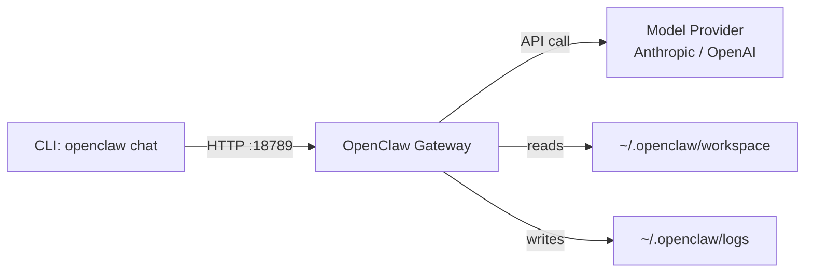

# Quickstart: OpenClaw in 15 Minutes

Get a working OpenClaw gateway running locally with a single model provider and CLI access.

## Prerequisites

- **Node.js 18+** -- check with `node --version`
- **One API key** from a supported model provider (Anthropic or OpenAI)

## 1. Install

```bash
npm install -g openclaw
```

Verify the installation:

```bash
openclaw --version
```

## 2. Initialize

```bash
openclaw init
```

This creates the `~/.openclaw/` directory with the following structure:

```
~/.openclaw/
  .env              # API keys and gateway configuration
  config.yml        # Gateway settings (port, logging, defaults)
  workspace/        # Agent workspace files (AGENTS.md, TOOLS.md, etc.)
  logs/             # Gateway request and error logs
```

The init command walks you through basic setup interactively. You can also run `openclaw init --defaults` to accept all defaults and configure manually afterward.

## 3. Configure a Model Provider

Open `~/.openclaw/.env` and add at least one API key:

```bash
# Option A: Anthropic (Claude)
ANTHROPIC_API_KEY=sk-ant-your-key-here

# Option B: OpenAI (GPT)
OPENAI_API_KEY=sk-your-key-here
```

You only need one provider to get started. You can add more later.

To set the key from the command line without editing the file directly:

```bash
# Appends to ~/.openclaw/.env
echo 'ANTHROPIC_API_KEY=sk-ant-your-actual-key' >> ~/.openclaw/.env
```

## 4. Start the Gateway

```bash
openclaw start
```

The gateway starts on port **18789** by default. You should see output like:

```
OpenClaw Gateway v0.x.x
Listening on http://localhost:18789
Model providers: anthropic
Workspace: ~/.openclaw/workspace
```

To run in the background:

```bash
openclaw start --daemon
```

## 5. Your First Conversation

```bash
openclaw chat "Hello"
```

You should get a response from the default model. This confirms the full pipeline works: CLI -> gateway -> model provider -> response.

For a multi-turn conversation:

```bash
openclaw chat
```

This opens an interactive session. Type `exit` or press Ctrl+C to end it.

## 6. Verify It Works

Run through this checklist:

- [ ] `openclaw --version` prints a version number
- [ ] `openclaw status` shows the gateway is running
- [ ] `openclaw chat "What model are you?"` returns a response
- [ ] `http://localhost:18789` is reachable (try `curl http://localhost:18789/health`)
- [ ] `~/.openclaw/.env` contains at least one valid API key

## 7. What's Running

After completing the quickstart, here is what you have:



**Gateway process** -- A local Node.js HTTP server that receives requests on port 18789, routes them to the configured model provider, and returns responses. The gateway manages conversation state, applies workspace configuration, and handles tool execution.

**Workspace** -- The `~/.openclaw/workspace/` directory contains agent definitions, tool configurations, and system prompts. The gateway reads these on every request so changes take effect immediately without restart.

**Configuration** -- All configuration lives under `~/.openclaw/`. The `.env` file holds secrets (API keys, tokens). The `config.yml` file holds non-secret settings (port, log level, default model).

## 8. Next Steps

- **[02-channels](../02-channels/)** -- Connect WhatsApp, Telegram, Discord, or Slack to your gateway
- **[08-workspace](../08-workspace/)** -- Customize agent behavior with AGENTS.md, TOOLS.md, and SOUL.md

## 9. Troubleshooting

### Port 18789 already in use

Another process is using the default port. Either stop it or change the port:

```bash
# Find what's using the port
lsof -i :18789

# Start on a different port
openclaw start --port 18790
```

### "No API key configured" error

The gateway cannot find a valid API key. Check:

1. `~/.openclaw/.env` exists and contains a key
2. The key variable name is exact (`ANTHROPIC_API_KEY`, not `ANTHROPIC_KEY`)
3. The key value has no trailing whitespace or quotes around it

### "openclaw: command not found"

The global npm bin directory is not in your PATH. Fix with:

```bash
# Find where npm installs global binaries
npm config get prefix

# Add to your shell profile (~/.zshrc or ~/.bashrc)
export PATH="$(npm config get prefix)/bin:$PATH"
```

### Node.js version too old

OpenClaw requires Node.js 18 or later. Check your version:

```bash
node --version
```

If it is below v18, upgrade via [nvm](https://github.com/nvm-sh/nvm):

```bash
nvm install 22
nvm use 22
```

### Gateway starts but chat returns errors

Check the logs for details:

```bash
# View recent logs
openclaw logs

# Or read the log file directly
tail -50 ~/.openclaw/logs/gateway.log
```

Common causes: expired API key, rate limiting, network firewall blocking outbound HTTPS.
