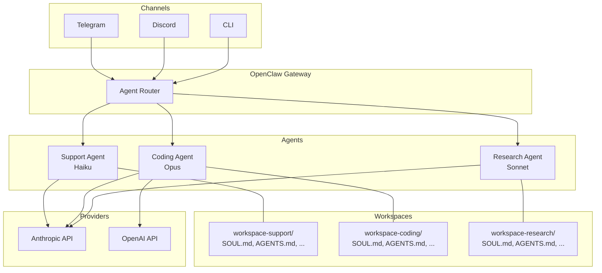

# 04 - Multi-Agent Setup

## Why Multiple Agents

A single agent works fine for personal use, but multiple agents become valuable when:

**Specialization.** A coding assistant needs Claude Opus and access to exec tools. A customer support bot needs Haiku and no shell access. Separate agents let you optimize each for its job.

**Cost optimization.** Route simple Q&A to a cheap, fast model (Haiku, GPT-4o-mini). Reserve expensive models (Opus) for complex tasks. A multi-agent setup can cut costs 5-10x without degrading quality where it matters.

**Channel isolation.** Your Telegram bot should not share context with your Discord server. Each agent has its own workspace, memory, and conversation state.

**Security boundaries.** A public-facing agent should have restricted tools and strict SOUL.md boundaries. An internal agent can be more permissive. Separate agents enforce this cleanly.

## Defining Agents in openclaw.json

Each agent is an entry in `agents.list`:

```jsonc
{
  "agents": {
    "defaults": {
      "model": {
        "primary": "anthropic/claude-sonnet-4-6",
        "fallbacks": ["openai/gpt-5.4"]
      },
      "subagents": { "model": "anthropic/claude-haiku-4-5" }
    },
    "list": [
      {
        "id": "coding",
        "name": "Coding Assistant",
        "workspace": "./workspace-coding",
        "model": {
          "primary": "anthropic/claude-opus-4-6"
        }
      },
      {
        "id": "support",
        "name": "Support Bot",
        "workspace": "./workspace-support",
        "model": {
          "primary": "anthropic/claude-haiku-4-5"
        }
      },
      {
        "id": "research",
        "name": "Research Agent",
        "workspace": "./workspace-research",
        "model": {
          "primary": "anthropic/claude-sonnet-4-6"
        }
      }
    ]
  }
}
```

Key points:
- `id` is the routing key referenced by plugins and channels.
- `workspace` points to a directory containing that agent's persona files.
- `model` overrides the defaults for this specific agent.
- Agents that omit `model` inherit from `agents.defaults`.

## Per-Agent Workspaces

Each agent gets its own workspace directory with the full set of persona files:

```
project-root/
  openclaw.json
  workspace-coding/
    SOUL.md          # "You are a senior software engineer..."
    AGENTS.md        # Coding-specific operational rules
    TOOLS.md         # exec enabled, file ops enabled
    IDENTITY.md
    USER.md
    MEMORY.md
  workspace-support/
    SOUL.md          # "You are a friendly customer support agent..."
    AGENTS.md        # Support-specific escalation rules
    TOOLS.md         # web_search enabled, exec disabled
    IDENTITY.md
    USER.md
    MEMORY.md
  workspace-research/
    SOUL.md
    AGENTS.md
    TOOLS.md
    ...
```

Each workspace is fully independent. Changes to the coding agent's SOUL.md do not affect the support agent.

## Agent Management CLI

Create and manage agents without hand-editing JSON:

```bash
# Add a new agent (creates workspace directory + config entry)
openclaw agents add work

# List all agents with their bindings
openclaw agents list --bindings

# Restart to pick up changes
openclaw gateway restart

# Verify channel connectivity
openclaw channels status --probe
```

## Agent Routing & Bindings

Channels are routed to agents via `bindings`. Bindings are evaluated in a **priority hierarchy**:

| Priority | Match Type | Example |
|----------|-----------|---------|
| 1 (highest) | Exact peer match | Specific DM or group ID |
| 2 | Parent peer match | Thread inheritance |
| 3 | Guild + roles | Discord guild with role |
| 4 | Guild ID | Any user in Discord guild |
| 5 | Team ID | Slack team |
| 6 | Account ID | Channel account match |
| 7 | Channel wildcard | `accountId: "*"` |
| 8 (lowest) | Fallback | Default agent |

> **Rule:** If multiple bindings match in the same tier, the first one in config order wins.

### Basic Binding Example

```jsonc
{
  "channels": {
    "telegram": {
      "enabled": true,
      "accounts": {
        "support-bot": { "botToken": "${TELEGRAM_BOT_TOKEN}", "dmPolicy": "pairing" }
      }
    },
    "discord": {
      "enabled": true,
      "accounts": {
        "coding-bot": { "botToken": "${DISCORD_BOT_TOKEN}" }
      }
    }
  },
  "bindings": [
    { "agentId": "support", "match": { "channel": "telegram", "accountId": "support-bot" } },
    { "agentId": "coding", "match": { "channel": "discord", "accountId": "coding-bot" } }
  ]
}
```

### Peer-Level Routing (Per-Person Agents)

Route specific contacts to specific agents on the same WhatsApp number:

```jsonc
{
  "bindings": [
    {
      "agentId": "alex",
      "match": { "channel": "whatsapp", "peer": { "kind": "direct", "id": "+15551230001" } }
    },
    {
      "agentId": "mia",
      "match": { "channel": "whatsapp", "peer": { "kind": "direct", "id": "+15551230002" } }
    },
    {
      "agentId": "default",
      "match": { "channel": "whatsapp" }
    }
  ]
}
```

> **Important:** Peer bindings always take precedence. Place them above broader channel matches.

### Same Channel, Different Models

Route WhatsApp to a fast model while Telegram uses a more capable one:

```jsonc
{
  "agents": {
    "list": [
      { "id": "chat", "model": { "primary": "anthropic/claude-sonnet-4-6" } },
      { "id": "opus", "model": { "primary": "anthropic/claude-opus-4-6" } }
    ]
  },
  "bindings": [
    { "agentId": "chat", "match": { "channel": "whatsapp" } },
    { "agentId": "opus", "match": { "channel": "telegram" } }
  ]
}
```

## Multi-Account Channels

Run multiple bot accounts on the same platform, each bound to a different agent.

### Multiple Telegram Bots

```jsonc
{
  "channels": {
    "telegram": {
      "accounts": {
        "default": { "botToken": "123456:ABC...", "dmPolicy": "pairing" },
        "alerts":  { "botToken": "987654:XYZ...", "dmPolicy": "allowlist" }
      }
    }
  },
  "bindings": [
    { "agentId": "main",   "match": { "channel": "telegram", "accountId": "default" } },
    { "agentId": "alerts", "match": { "channel": "telegram", "accountId": "alerts" } }
  ]
}
```

### Multiple WhatsApp Numbers

```bash
openclaw channels login --channel whatsapp --account personal
openclaw channels login --channel whatsapp --account biz
```

### Multiple Discord Bots

```jsonc
{
  "channels": {
    "discord": {
      "accounts": {
        "default": { "token": "${DISCORD_BOT_TOKEN_MAIN}" },
        "coding":  { "token": "${DISCORD_BOT_TOKEN_CODING}" }
      }
    }
  }
}
```

> **Note:** Each Discord bot needs its own token, Message Content Intent enabled, and guild invitations.

## Per-Agent Sandbox & Tool Restrictions

Isolate what each agent can do:

```jsonc
{
  "agents": {
    "list": [
      {
        "id": "family",
        "sandbox": { "mode": "all", "scope": "agent" },
        "tools": {
          "allow": ["read"],
          "deny": ["exec", "write"]
        }
      },
      {
        "id": "dev",
        "tools": {
          "allow": ["exec", "read", "write", "web_search"]
        }
      }
    ]
  }
}
```

> **Note:** `tools.elevated` is **global** and sender-based — it cannot be configured per agent.

## Cross-Agent Memory Search

Agents can optionally search other agents' session transcripts:

```jsonc
{
  "agents": {
    "list": [
      {
        "id": "research",
        "memorySearch": {
          "qmd": {
            "extraCollections": ["coding", "support"]
          }
        }
      }
    ]
  }
}
```

This lets the research agent search QMD session transcripts from the coding and support agents. It's opt-in — no cross-access by default.

## Session Management

Configure how sessions are scoped and reset:

```jsonc
{
  "session": {
    "scope": "per-sender",
    "resetTriggers": ["/new", "/reset"],
    "reset": {
      "mode": "daily",
      "atHour": 4,
      "idleMinutes": 10080
    }
  }
}
```

| Key | Options | Description |
|-----|---------|-------------|
| `scope` | `per-sender`, `shared` | Whether each user gets their own session |
| `resetTriggers` | Array of strings | Commands that reset the session |
| `reset.mode` | `daily`, `idle`, `manual` | When sessions auto-reset |
| `reset.atHour` | 0-23 | Hour for daily reset |
| `reset.idleMinutes` | Number | Reset after N minutes of inactivity |

## Isolation Rules

### No Shared Credentials

Each agent reads auth from its own state directory:

```
~/.openclaw/agents/<agentId>/agent/   # Auth profiles, model registry
~/.openclaw/agents/<agentId>/sessions/ # Chat history
```

> **Never** reuse `agentDir` across agents — it causes auth/session collisions. If you need to share credentials, copy `auth-profiles.json`.

### Skills Isolation

- Agent-specific skills: `<workspace>/skills/`
- Shared skills: `~/.openclaw/skills/`

## ClawTeam Swarm Orchestration

For advanced multi-agent coordination, ClawTeam provides a Python-based swarm framework that orchestrates multiple OpenClaw agents working together on complex tasks.

**What ClawTeam does:**
- Coordinates multiple agents via tmux sessions
- Implements leader/worker patterns for task decomposition
- Provides inter-agent communication channels
- Manages shared state across agents

**Basic setup:**

```bash
# Install ClawTeam
pip install clawteam-openclaw

# Initialize a swarm configuration
clawteam init my-swarm
```

**Swarm configuration example:**

```python
from clawteam import Swarm, Agent

swarm = Swarm(
    agents=[
        Agent(id="leader", role="coordinator", model="claude-opus-4-6"),
        Agent(id="coder", role="worker", model="claude-sonnet-4-6"),
        Agent(id="reviewer", role="worker", model="claude-sonnet-4-6"),
    ],
    strategy="leader-workers"  # leader decomposes, workers execute
)

swarm.run("Build a REST API for user management")
```

**When to use ClawTeam vs plain multi-agent:**
- Plain multi-agent: different agents for different channels/users. They do not interact.
- ClawTeam swarm: multiple agents collaborating on the same task, passing context between each other.

## Architecture Diagram



## Tips

- Start with one agent. Add more only when you have a clear reason (different channel, different cost tier, different security boundary).
- Name workspaces descriptively: `workspace-coding`, `workspace-support`, not `workspace-2`.
- Test each agent independently via CLI (`openclaw message send --agent coding "hello"`) before connecting channels.
- Monitor per-agent costs separately to validate your cost optimization assumptions.
