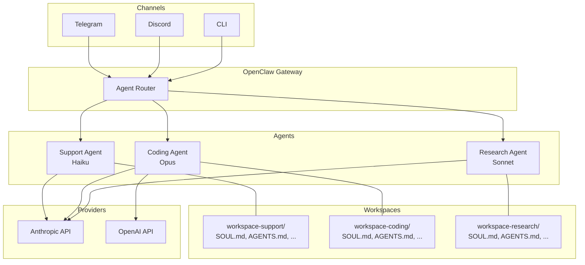

# 04 - Multi-Agent Setup

## Why Multiple Agents

A single agent works fine for personal use, but multiple agents become valuable when:

**Specialization.** A coding assistant needs Claude Opus and access to exec tools. A customer support bot needs Haiku and no shell access. Separate agents let you optimize each for its job.

**Cost optimization.** Route simple Q&A to a cheap, fast model (Haiku, GPT-4o-mini). Reserve expensive models (Opus) for complex tasks. A multi-agent setup can cut costs 5-10x without degrading quality where it matters.

**Channel isolation.** Your Telegram bot should not share context with your Discord server. Each agent has its own workspace, memory, and conversation state.

**Security boundaries.** A public-facing agent should have restricted tools and strict SOUL.md boundaries. An internal agent can be more permissive. Separate agents enforce this cleanly.

## Defining Agents in openclaw.json

Each agent is an entry in `agents.list`:

```jsonc
{
  "agents": {
    "defaults": {
      "models": {
        "default": "claude-sonnet-4-20250514",
        "fallback": "gpt-4o"
      }
    },
    "list": [
      {
        "id": "coding",
        "name": "Coding Assistant",
        "workspace": "./workspace-coding",
        "models": {
          "default": "claude-opus-4-20250514"
        }
      },
      {
        "id": "support",
        "name": "Support Bot",
        "workspace": "./workspace-support",
        "models": {
          "default": "claude-haiku-4-20250514"
        }
      },
      {
        "id": "research",
        "name": "Research Agent",
        "workspace": "./workspace-research",
        "models": {
          "default": "claude-sonnet-4-20250514"
        }
      }
    ]
  }
}
```

Key points:
- `id` is the routing key referenced by plugins and channels.
- `workspace` points to a directory containing that agent's persona files.
- `models` overrides the defaults for this specific agent.
- Agents that omit `models` inherit from `agents.defaults`.

## Per-Agent Workspaces

Each agent gets its own workspace directory with the full set of persona files:

```
project-root/
  openclaw.json
  workspace-coding/
    SOUL.md          # "You are a senior software engineer..."
    AGENTS.md        # Coding-specific operational rules
    TOOLS.md         # exec enabled, file ops enabled
    IDENTITY.md
    USER.md
    MEMORY.md
  workspace-support/
    SOUL.md          # "You are a friendly customer support agent..."
    AGENTS.md        # Support-specific escalation rules
    TOOLS.md         # web_search enabled, exec disabled
    IDENTITY.md
    USER.md
    MEMORY.md
  workspace-research/
    SOUL.md
    AGENTS.md
    TOOLS.md
    ...
```

Each workspace is fully independent. Changes to the coding agent's SOUL.md do not affect the support agent.

## Agent Routing

Channels are routed to agents via the `agent` field in plugin config:

```jsonc
{
  "plugins": {
    "telegram": {
      "enabled": true,
      "botToken": "${TELEGRAM_BOT_TOKEN}",
      "agent": "support"
    },
    "discord": {
      "enabled": true,
      "botToken": "${DISCORD_BOT_TOKEN}",
      "agent": "coding"
    }
  }
}
```

Routing rules:
- Each plugin instance maps to exactly one agent.
- The CLI (`openclaw chat`) defaults to the first agent in the list unless `--agent <id>` is specified.
- To route the same channel type to different agents, run multiple OpenClaw instances on different ports.

## ClawTeam Swarm Orchestration

For advanced multi-agent coordination, ClawTeam provides a Python-based swarm framework that orchestrates multiple OpenClaw agents working together on complex tasks.

**What ClawTeam does:**
- Coordinates multiple agents via tmux sessions
- Implements leader/worker patterns for task decomposition
- Provides inter-agent communication channels
- Manages shared state across agents

**Basic setup:**

```bash
# Install ClawTeam
pip install clawteam-openclaw

# Initialize a swarm configuration
clawteam init my-swarm
```

**Swarm configuration example:**

```python
from clawteam import Swarm, Agent

swarm = Swarm(
    agents=[
        Agent(id="leader", role="coordinator", model="claude-opus-4-20250514"),
        Agent(id="coder", role="worker", model="claude-sonnet-4-20250514"),
        Agent(id="reviewer", role="worker", model="claude-sonnet-4-20250514"),
    ],
    strategy="leader-workers"  # leader decomposes, workers execute
)

swarm.run("Build a REST API for user management")
```

**When to use ClawTeam vs plain multi-agent:**
- Plain multi-agent: different agents for different channels/users. They do not interact.
- ClawTeam swarm: multiple agents collaborating on the same task, passing context between each other.

## Architecture Diagram



## Tips

- Start with one agent. Add more only when you have a clear reason (different channel, different cost tier, different security boundary).
- Name workspaces descriptively: `workspace-coding`, `workspace-support`, not `workspace-2`.
- Test each agent independently via CLI (`openclaw chat --agent coding`) before connecting channels.
- Monitor per-agent costs separately to validate your cost optimization assumptions.
