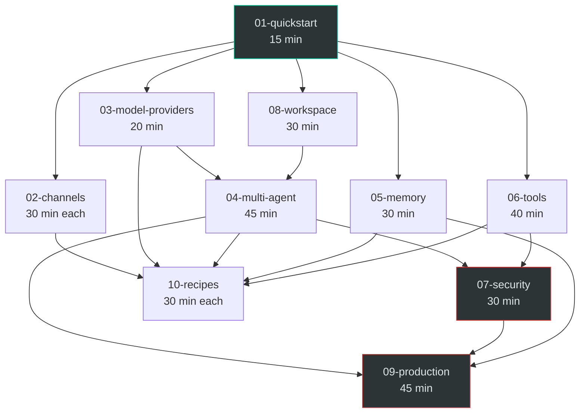

# OpenClaw Cookbook — Learning Roadmap

Pick the right path, skip what you don't need, build real things fast.

---

## Self-Assessment Quiz

Answer these five questions to determine your starting path.

1. **Have you run a Node.js project with `npm install -g` before?**
   - No -> Start at **Beginner**
   - Yes -> Continue

2. **Have you configured a bot on Telegram, Discord, or Slack?**
   - No -> Start at **Beginner**
   - Yes -> Continue

3. **Do you need more than one AI agent with different personalities or roles?**
   - No -> **Beginner** path covers everything you need
   - Yes -> Continue

4. **Will more than 3 people use this system, or does it need uptime guarantees?**
   - No -> **Builder** path is your target
   - Yes -> Continue

5. **Do you need monitoring, cost controls, security hardening, or SLA commitments?**
   - No -> **Builder** path is your target
   - Yes -> **Production** path

### Scoring

| Stopped at question | Path |
|---------------------|------|
| 1 or 2 | **Beginner** — Personal AI in under an hour |
| 3 | **Beginner** — One agent, one channel, done |
| 4 | **Builder** — Multi-agent with tools and memory |
| 5 (answered No) | **Builder** |
| 5 (answered Yes) | **Production** — Full deployment for a team or company |

---

## Learning Paths

### Beginner Path — Personal AI (1.5 hours)

You want a private AI assistant on your phone or desktop. One agent, one channel, your API key.

| Order | Module | Time | What you get |
|-------|--------|------|--------------|
| 1 | 01-quickstart | 15 min | OpenClaw running locally |
| 2 | 02-channels (pick one) | 30 min | Bot on Telegram, Discord, Slack, or WhatsApp |
| 3 | 08-workspace | 30 min | Custom personality via SOUL.md and IDENTITY.md |
| 4 | 03-model-providers | 20 min | Pick your model, add a fallback |

**Total: ~1.5 hours.** Skip 03 if you are fine with the default model.

### Builder Path — Multi-Agent System (4 hours)

You want specialized agents (support, coding, research), custom tools, and persistent memory. Still self-hosted, still for a small group.

| Order | Module | Time | What you get |
|-------|--------|------|--------------|
| 1 | 01-quickstart | 15 min | OpenClaw running locally |
| 2 | 02-channels (1-2 channels) | 30-60 min | Bots on your chosen platforms |
| 3 | 03-model-providers | 20 min | Multi-model routing with fallbacks |
| 4 | 08-workspace | 30 min | Persona programming for each agent |
| 5 | 04-multi-agent | 45 min | Specialized agents + ClawTeam swarm |
| 6 | 05-memory | 30 min | LanceDB long-term memory |
| 7 | 06-tools | 40 min | Custom tools, exec, MCP integration |
| 8 | 10-recipes (pick one) | 30 min | End-to-end working scenario |

**Total: ~4 hours.** You can stop after step 5 if you don't need memory or tools yet.

### Production Path — Team/Company Deployment (6+ hours)

You need security, monitoring, cost controls, and reliability. Everything from Builder, plus hardening and ops.

| Order | Module | Time | What you get |
|-------|--------|------|--------------|
| 1-7 | All Builder modules | 3.5 hrs | Full multi-agent system |
| 8 | 07-security | 30 min | SOUL.md hardening, auth, exec allowlists |
| 9 | 09-production | 45 min | Monitoring, logging, cost control |
| 10 | 02-channels (remaining) | 30-60 min | All channels your team needs |
| 11 | 10-recipes (2-3 recipes) | 60-90 min | Battle-tested patterns |

**Total: ~6+ hours.** Module 07 (security) should be done before any external users touch the system.

---

## Module Dependency Graph

### How to read the graph

- **Arrows mean "should be done first."** `01 -> 02` means do quickstart before channels.
- **01-quickstart** is the root -- everything depends on it.
- **05-memory** and **06-tools** only depend on 01. You can do them early if that is your priority.
- **04-multi-agent** requires both 03 (model providers) and 08 (workspace) because each agent needs its own model config and persona.
- **07-security** depends on 04 and 06 because security hardening is most useful after you have agents and tools to lock down.
- **09-production** sits at the top -- it requires multi-agent, security, and memory to be meaningful.
- **10-recipes** pull from multiple modules. Check each recipe's prerequisites before starting.

---

## Time Estimates Per Module Per Path

| Module | Beginner | Builder | Production |
|--------|----------|---------|------------|
| 01-quickstart (15 min) | Required | Required | Required |
| 02-channels (30 min each) | 1 channel (30 min) | 1-2 channels (30-60 min) | All needed (60-120 min) |
| 03-model-providers (20 min) | Optional (20 min) | Required (20 min) | Required (20 min) |
| 04-multi-agent (45 min) | Skip | Required (45 min) | Required (45 min) |
| 05-memory (30 min) | Skip | Required (30 min) | Required (30 min) |
| 06-tools (40 min) | Skip | Required (40 min) | Required (40 min) |
| 07-security (30 min) | Skip | Skip | Required (30 min) |
| 08-workspace (30 min) | Required (30 min) | Required (30 min) | Required (30 min) |
| 09-production (45 min) | Skip | Skip | Required (45 min) |
| 10-recipes (30 min each) | Skip | 1 recipe (30 min) | 2-3 recipes (60-90 min) |
| **Total** | **~1.5 hrs** | **~4 hrs** | **~6+ hrs** |

---

## "You're Ready When..." Checklists

### Beginner Level

You are ready when you can answer yes to all of these:

- [ ] OpenClaw is installed and `openclaw --version` prints a version number
- [ ] You can start the gateway with `openclaw gateway` and it stays running
- [ ] You have a bot on at least one channel (Telegram, Discord, Slack, or WhatsApp) that responds to messages
- [ ] You have edited SOUL.md to give your agent a distinct personality
- [ ] You can send a message to your bot from your phone and get a useful response
- [ ] You understand where workspace files live (`~/.openclaw/workspace/`) and what each one does

### Builder Level

Everything from Beginner, plus:

- [ ] You have at least two agents with different roles (e.g., support + coding)
- [ ] Each agent uses its own model provider or model configuration
- [ ] ClawTeam swarm mode works -- you can trigger multi-agent collaboration on a task
- [ ] Memory is enabled and your agent recalls details from previous conversations
- [ ] You have at least one custom tool or MCP integration that your agent can invoke
- [ ] You can explain how agent routing works -- which messages go to which agent and why
- [ ] You have completed at least one recipe from start to finish with all verification steps passing

### Production Level

Everything from Builder, plus:

- [ ] SOUL.md is hardened -- your agent refuses to execute unauthorized commands or reveal system prompts
- [ ] Exec allowlists are configured -- only approved commands can run
- [ ] Authentication is set up -- unauthorized users cannot interact with your agents
- [ ] Monitoring is active -- you can see request logs, error rates, and response latency
- [ ] Cost controls are in place -- you have token budgets or spending limits configured
- [ ] You have tested failure scenarios: model provider goes down, memory store is unavailable, channel disconnects
- [ ] You can redeploy from scratch using your configs and docker-compose files in under 30 minutes
- [ ] You have run at least two recipes end-to-end in a production-like environment

---

## Where to Go Next

- **Stuck?** Check [troubleshooting/](./troubleshooting/) before searching online.
- **Want a working example?** Start with the [Personal AI on Telegram](./10-recipes/personal-ai-on-telegram/) recipe.
- **Ready to contribute?** See [Contributing](./README.md#contributing) in the main README.
